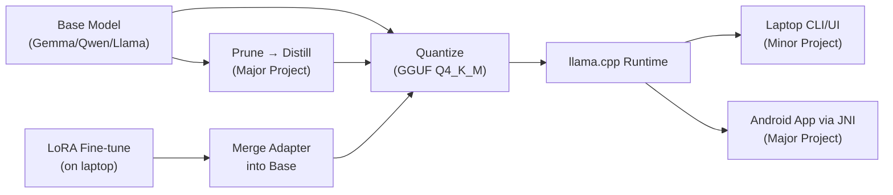

# On-Device AI Assistant — Comprehensive Feasibility Teardown

## Understanding Summary

- **What:** A fully offline AI assistant running entirely on-device (no cloud calls) on budget Android phones (₹8K–20K, 4–8GB RAM)
- **Why:** Privacy enforced structurally (no INTERNET permission), not just claimed. The Indian market context makes budget hardware the real constraint.
- **Who:** Solo developer, comfortable with Python + basic C/C++, limited Android experience. Indian engineering college minor → major project pipeline.
- **Core constraint:** Zero network calls, ever. Privacy is architectural.
- **Timeline:** Flexible (~1 semester for minor, ~2 semesters for major), but needs a working demo at the minor milestone
- **Language:** English-only for minor; multilingual is a stretch goal
- **Non-goal:** This is not a chatbot competing with ChatGPT — it's a lightweight assistant for structured, scoped tasks

---

## 1. Technical Feasibility — Will It Actually Run?

### The Hard Numbers

| Device Class | Available RAM (after Android OS) | Max Model Size | Expected Decode Speed (Q4_K_M) | Verdict |
|---|---|---|---|---|
| ₹8K–10K phone (4GB, SD 680/Dimensity 700) | ~2.0–2.5 GB | **1B only** | 8–12 tok/s (1B) | ⚠️ Functional, not comfortable |
| ₹12K–15K phone (6GB, Dimensity 7200) | ~3.5–4.0 GB | **2B comfortable, 3B tight** | 5–8 tok/s (2B) | ✅ Sweet spot |
| ₹18K–20K phone (8GB, SD 7s Gen 2+) | ~5.0–6.0 GB | **3B comfortable** | 6–10 tok/s (2B), 4–6 tok/s (3B) | ✅ Plenty of headroom |
| Dev laptop CPU-only (i5-13420H) | ~12 GB free | Any ≤7B | ~15–25 tok/s (2B) | ✅ Easy |

### Model File Sizes (GGUF Q4_K_M)

| Model | On-Disk Size | Runtime RAM (model + KV cache + overhead) |
|---|---|---|
| Qwen3 0.6B | ~400 MB | ~600–800 MB |
| Llama 3.2 1B | ~600–700 MB | ~1.0–1.3 GB |
| Qwen3 1.7B | ~1.0–1.2 GB | ~1.5–1.8 GB |
| Gemma 4 E2B (~2.3B eff.) | ~1.3–1.5 GB | ~2.0–2.5 GB |
| Phi-4-mini (3.8B) | ~2.2 GB | ~3.0–3.5 GB |
| Llama 3.2 3B | ~1.7–2.0 GB | ~2.5–3.2 GB |

### Realistic Performance Expectations

> [!IMPORTANT]
> **Set these as your baseline expectations for a ₹10K–15K phone running a 2B Q4 model:**
> - **Time to first token:** 2–5 seconds (depends on prompt length)
> - **Sustained decode speed:** 4–8 tokens/sec at room temp → drops to 3–5 tok/s after 1–2 min of continuous generation due to thermal throttling
> - **Usable context window:** 1K–2K tokens (going higher eats RAM from KV cache)
> - **Practical response length:** ~50–150 tokens before thermal becomes an issue
> - **This means:** a short assistant reply takes 5–20 seconds. Acceptable for a utility assistant, not for fluid conversation.

### Thermal Throttling — The Underrated Killer

This is the constraint most hobby projects overlook:

- Budget SoCs (Snapdragon 695, Dimensity 700) throttle heavily after **1–2 minutes** of continuous inference
- Performance drops **30–50%** from peak after sustained generation
- The phone gets **physically warm** — user perception matters
- **Mitigations:** Limit to 4 CPU threads, cap `max_tokens`, add deliberate cooldown, keep responses short
- This actually *aligns well with an assistant* (short structured replies) vs. a chatbot (long freeform conversation)

### Memory Bandwidth — The Real Bottleneck

- Budget phone LPDDR4X: ~25–35 GB/s
- Mid-range LPDDR5: ~50+ GB/s
- A 2B Q4 model streams ~1.2 GB of weights per token during decode
- Theoretical max on LPDDR4X: ~20–28 tok/s before any overhead
- **This is why quantization helps speed, not just memory** — smaller models = fewer bytes to stream per token

> [!TIP]
> **Feasibility verdict (technical):** ✅ **Feasible.** A 2B model at Q4 on a 6GB phone will run. On a true 4GB phone, you'll need to drop to 1B. The experience will be "functional proof-of-concept" quality — usable, not fluid. This is exactly the right framing for a minor project demo.

---

## 2. Academic Feasibility — Is the Scope Right?

### Minor Project Assessment

| Aspect | Assessment |
|---|---|
| **Ambition level** | ✅ Well-calibrated. A working offline assistant with benchmarks is impressive without being impossible. |
| **Novelty** | ✅ Privacy-by-architecture (no INTERNET permission) is a clean, defensible angle. Not novel research, but a strong engineering contribution. |
| **Demo-ability** | ✅ Airplane mode demo is viscerally convincing. Evaluators can verify the claim instantly. |
| **Scope risk** | ⚠️ The stretch goal (running on a real phone) may not land in time. **Recommendation:** frame the laptop version as the deliverable, phone as stretch. |
| **Similar projects** | Multiple IIT/NIT capstone projects have done similar work (quantized LLM on Raspberry Pi, mobile Q&A assistant). You won't be a pioneer, but you'll be in good company. |
| **Evaluator appeal** | ✅ Checks all boxes: real problem (privacy), end-to-end system (not "I used an API"), measurable benchmarks, honest about limitations. |

### Major Project Assessment

| Aspect | Assessment |
|---|---|
| **Research contribution** | ✅ A prune→distill→quantize pipeline targeting your specific task set is a legitimate applied-ML contribution. Not theoretical novelty, but engineering rigor. |
| **Scope risk** | ⚠️ Tool-calling + RAG + voice + compression + personalization is **a lot** for one person. Prioritize ruthlessly. |
| **Publication potential** | ✅ If you produce a clean comparison (your compressed model vs. cloud API on the same tasks, with latency/accuracy/privacy metrics), that's publishable in an applied-ML venue. |
| **Viva strength** | ✅ The "how did you go from base model to what's on the phone" question is natural, and your reproducibility log answers it. |

> [!WARNING]
> **Major project scope creep risk is HIGH.** For one person, pick 2 of these 5 as primary, treat the rest as stretch:
> 1. Tool-calling with LoRA fine-tune
> 2. On-device RAG
> 3. Voice I/O
> 4. Compression research (prune→distill→quantize)
> 5. Personalization via user LoRA
>
> **My recommendation:** #1 (tool-calling) and #4 (compression research) as primary. These have the highest demo impact and academic rigor respectively. Voice (#3) is a strong third if time permits.

---

## 3. Architectural Feasibility — Does the Pipeline Work End-to-End?

### Pipeline: Base Model → Compress → Runtime → App

#### Stage 1: Base Model Selection → ✅ Low risk

- Multiple viable options exist at every size point
- Community GGUF conversions are readily available
- No custom model training needed

#### Stage 2: Quantization → ✅ Low risk, near-solved

- `llama.cpp`'s quantization tooling is mature and well-documented
- Q4_K_M is the default "good enough" choice — no experimentation needed
- One command: `llama-quantize model.gguf model-Q4_K_M.gguf Q4_K_M`

#### Stage 3: Runtime (llama.cpp) → ✅ Low risk

- De facto standard, massive community, broadest hardware compatibility
- `llama-cpp-python` for laptop prototyping works out of the box
- JNI bindings for Android exist (see PocketPal AI's implementation)
- **Alternative path (Gemma-specific):** LiteRT-LM is the official Google runtime, but thinner documentation and community. Stick with llama.cpp unless you have a specific reason to switch.

#### Stage 4: Laptop App (Minor Project) → ✅ Low risk

- Python CLI + Streamlit/Flet is trivial
- The real work is in the prompt engineering and eval, not the UI

#### Stage 5: Android App (Major Project) → ⚠️ Medium risk

- **Your limited Android experience is the main risk here**
- Recommended approach: **Study and fork PocketPal AI** (React Native + llama.cpp JNI) rather than building from scratch in Kotlin
- Alternative: Use Google's AI Edge Gallery as a reference if going the LiteRT-LM path
- The JNI bridge (calling C++ llama.cpp from Java/Kotlin) is the trickiest piece — don't underestimate it
- **Termux as the minor project phone stretch goal** is a smart intermediate step — proves the binary runs on ARM without any Android app dev

#### Stage 6: LoRA Fine-Tuning (Major Project) → ✅ Feasible on laptop

- RTX 4050 (6GB VRAM) + QLoRA can fine-tune a 2B model
- Recommended stack: Hugging Face `transformers` + `peft` + `bitsandbytes` + `trl`
- A small function-calling dataset (1K–5K examples) would take a few hours to train
- Merge adapter → re-quantize to GGUF → deploy. Well-trodden path.

#### Stage 7: On-Device RAG (Major Project) → ⚠️ Medium risk

| Approach | RAM Cost | Quality | Complexity |
|---|---|---|---|
| Qwen3-Embedding-0.6B + FAISS | ~600–800 MB (on top of chat model) | High | Medium |
| all-MiniLM-L6-v2 (ONNX) + FAISS | ~80–150 MB | Medium | Low |
| BM25 keyword search (no ML) | ~10–20 MB | Low | Very low |
| **Sequential loading** (embed → unload → chat) | Same as chat model alone | High | Medium |

- On a 6GB phone with a 2B chat model already loaded (~2.5 GB), adding a 600 MB embedding model leaves **~0.5–1.0 GB** for everything else — very tight
- **Recommended:** Sequential loading strategy, or use a tiny embedding model
- For the minor project: **skip RAG entirely**

#### Stage 8: Voice I/O (Major Project) → ✅ Feasible

- whisper.cpp `tiny` (~75 MB): 1–2 sec for a 5-second clip on budget SoC. Adequate for short commands.
- Android's built-in TTS: zero additional model cost
- Load whisper only when activated, unload after transcription
- **Risk:** whisper `tiny` struggles with accented English and noisy environments

#### Stage 9: Compression Research (Major Project) → ✅ Feasible, well-scoped

- **Recommended pipeline:** Wanda pruning (simple, no retraining) → Recovery fine-tune with LoRA → Quantize to GGUF
- Alternative: LLM-Pruner (structured pruning, removes entire attention heads)
- The contribution isn't a new algorithm — it's **a rigorous empirical study** of compress→deploy on a specific task set and target hardware
- Compare: (a) off-the-shelf Q4 vs. (b) your pruned+distilled+Q4 model — on the same eval set, measuring accuracy, latency, RAM, and energy
- **Estimated effort:** 4–6 weeks of experimentation once the base system works

> [!TIP]
> **Architectural verdict:** ✅ **The pipeline works end-to-end.** Every stage uses mature, well-documented tooling. The riskiest stage is the Android app (Stage 5), which is mitigated by studying/forking existing open-source apps. The llama.cpp ecosystem is the right default choice — it's not the fastest runtime, but it's the most portable, most documented, and has the largest community.

---

## 4. Model Recommendation Matrix

### For the Minor Project

| Priority | Model | Why |
|---|---|---|
| **1st choice** | **Qwen3 1.7B** | Apache 2.0 (cleanest license), strong multilingual if you add Hindi later, good quality at this size, broad llama.cpp support |
| 2nd choice | Llama 3.2 1B | Most mature tooling/community, officially mobile-optimized, but smaller = weaker quality |
| 3rd choice | Gemma 4 E2B | Best quality, native function calling, but license is more restrictive and it's heavier (~2.3B effective) |

### For the Major Project

| Priority | Model | Why |
|---|---|---|
| **1st choice** | **Gemma 4 E2B** | Native function calling is a huge advantage for tool-calling (your primary major project feature). The multimodal input (text+image+audio) opens options. Worth accepting the license overhead. |
| 2nd choice | Qwen3 1.7B + LoRA | If you want to stay Apache 2.0 and make function-calling work via LoRA fine-tuning |
| Embedding model | all-MiniLM-L6-v2 (ONNX, ~80 MB) | Much lighter than Qwen3-Embedding-0.6B, adequate for English-only RAG over small corpora |

> [!NOTE]
> **You don't have to commit now.** For the minor project, start with Qwen3 1.7B (safest license, good enough quality). Evaluate Gemma 4 E2B in parallel on your laptop. Make the major project model decision after you have hands-on experience with both.

---

## 5. License Comparison

| Model | License | Academic Use | Open-Source Publication | Key Gotcha |
|---|---|---|---|---|
| Qwen3 0.6B / 1.7B | **Apache 2.0** | ✅ | ✅ Fully permissive | None |
| Qwen3-Embedding-0.6B | **Apache 2.0** | ✅ | ✅ Fully permissive | None |
| Phi-4-mini | **MIT** | ✅ | ✅ Fully permissive | Verify current terms — Microsoft has changed licenses between Phi versions |
| Llama 3.2 1B/3B | Community License | ✅ | ⚠️ Not OSI "open source" | Must accept Meta's license; >700M MAU restriction (irrelevant for you) |
| Gemma 4 E2B/E4B | Gemma Terms of Use | ✅ | ⚠️ Attribution required | Cannot use outputs to train competing models |

**Safest for publication:** Qwen (Apache 2.0) or Phi (MIT).

---

## 6. Risk Register

| Risk | Likelihood | Impact | Mitigation |
|---|---|---|---|
| 4GB phone can't run 2B model | High | Medium | Target 6GB phones as primary; have Qwen3 0.6B / Llama 1B as fallback |
| Thermal throttling makes phone unusable | Medium | High | Short responses, 4-thread limit, design for bursts not sustained generation |
| Android JNI integration is harder than expected | Medium | High | Fork PocketPal AI; use Termux as intermediate proof; start Android dev early |
| LoRA fine-tuning doesn't fit in 6GB VRAM | Low | Medium | Use QLoRA (4-bit base + LoRA), reduce rank, reduce batch size |
| Function calling unreliable from small models | Medium | High | LoRA fine-tune on structured output examples; constrained decoding (grammar mode in llama.cpp) |
| Solo scope creep in major project | High | High | Pick 2 of 5 features as primary, treat rest as stretch. Commit in writing. |
| Timeline slip due to Android learning curve | Medium | Medium | Start Android exploration in parallel with minor project, not after |
| Compression research doesn't yield meaningful improvement | Medium | Low | The negative result is still publishable ("off-the-shelf quantization is sufficient for X-size models on Y tasks") |

---

## 7. Concrete Recommendations

### Do First (this week)

1. **Install llama.cpp** on your laptop, download Qwen3-1.7B-Q4_K_M GGUF, and run it in CPU-only mode. Measure tok/s. This gives you ground truth in 30 minutes.
2. **Install PocketPal AI** on your phone (or whatever budget Android you have). Try Llama 3.2 1B. Note the real experience — speed, heat, responsiveness.
3. **Write 10 test prompts** covering your minor project tasks (summarize, rewrite, translate, basic math, "note this"). Run them through the model. Evaluate quality honestly.

### Minor Project Strategy

- **Deliverable:** Laptop CLI/Streamlit app + benchmark report. Phone demo via Termux as stretch.
- **Model:** Qwen3 1.7B Q4_K_M via llama.cpp
- **Eval:** 20–30 hand-built prompts, measured for correctness + tok/s + RAM
- **Demo killer:** Airplane mode toggle. "Watch — the network is off. Now ask it anything from our task set."

### Major Project Strategy (draft, refine when you get there)

- **Primary features:** Tool-calling (LoRA fine-tuned) + Compression research
- **Secondary features:** Voice I/O (whisper.cpp tiny)
- **Stretch features:** RAG, personalization
- **Model:** Gemma 4 E2B or Qwen3 1.7B (decision after minor project experience)
- **Android app:** Fork PocketPal AI or AI Edge Gallery, don't build from scratch

---

## 8. Assumptions (Explicit)

1. Android is the real target; laptop is dev + fallback ✅ (confirmed)
2. Solo developer ✅ (confirmed)
3. English-only for minor project ✅ (confirmed)
4. Flexible timeline ✅ (confirmed)
5. The college evaluators care more about a working demo + honest benchmarks than theoretical novelty *(assumed — confirm)*
6. You have or will acquire a 6GB+ budget Android phone for testing *(assumed — confirm)*
7. The "no INTERNET permission" enforcement is acceptable to evaluators as the privacy proof *(assumed — confirm)*
8. You're comfortable with the model quality tradeoff (small models won't match GPT-4 quality on open-ended tasks) *(assumed — confirmed in brief)*

---

## Open Questions

1. **Phone specs:** What specific phone do you have / plan to test on? (Exact model, RAM, SoC matter for setting expectations)
2. **Evaluator expectations:** Do your evaluators expect a published paper, or is a working demo + technical report sufficient for the minor project?
3. **Major project commitment:** Have you formally committed to extending this into the major project, or is that still tentative?
4. **Multilingual priority:** For the major project, is Hindi support a real requirement, or a "nice to have"?
5. **Emulator strategy:** You mentioned wanting to test on emulation first — be aware that Android emulators run on your laptop's x86 CPU and will give **misleadingly fast** numbers. They're useful for UI development but not for performance benchmarking. Is this understood?
